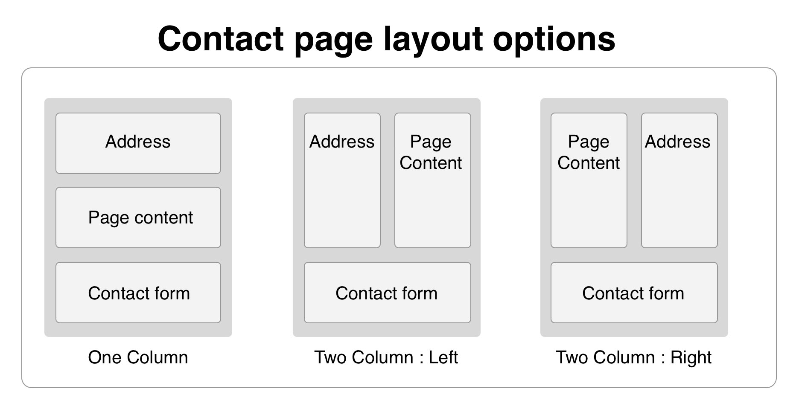

# Sprockets Theme

Sprockets is a custom theme for [GRAV CMS](https://getgrav.org). This theme is built with the Simple Grid framework and provides a flexible, responsive base for creating a custom, good looking site. Sprockets uses functionality that is only available in Grav 1.4+, and may not function properly on earlier versions.

## Features

* Lightweight and minimal for optimal performance
* [Simple Grid](https://simplegrid.io/) CSS Framework
* Fully responsive, grid based layout
* Dropdown menu support
* SCSS based CSS source files for easy customization
* [Slippry Image Carousel](http://slippry.com) support
* Built-in support for on-page navigation
* Multiple page template types
* [Font Awesome 5](https://fontawesome.com) icon support
* Custom Drop Caps can be enabled
* Instgram feed that can be enabled on the about page
* Social site configuration and linking
  * Facebook
  * Twitter
  * LinkedIn
  * Instagram
  * Flickr
  * Pinterest
  * and more....

### Supported Page Templates

* Default view    `page.md`
* Inventory view  `inventory.md`
* Categories view `categories.md`
* Item view       `item.md`
* About view      `about.md`
* Staff Bio view  `bio.md`
* Contact view    `contact.md`
* Error view      `error.md`
* Widgets
  * Slippry Carousel (setup in page.md front matter)
  * Hero Showcase (setup in page.md front matter)

## Using this theme

To install the theme into an existing GRAV site, copy the contents of the `user > pages` folder into the sites pages folder and the `camera-shop` folder into the sites `themes` folder and set the `site.theme` to `camera-shop` in the sites `site.yaml.` file in the `config` folder.

**Note**   
This repo is setup so that you can simply set the repo as a ready to run [GRAV](http://getgrav.org) site to make it easy to get it up and running locally. Refer to GRAVs documentation for more information on GRAV and GRAV Development.

### Configuration

All of the site settings are configured in the sprockets.yaml file.

* name (site or business name)
* dropdown.enabled: true/false
* dropcaps.enabled: true/false
* copyright (displays in site footer)
* business
  * name (added here so it could be different from site name)
  * address 1
  * address 2 (optional)
  * address 3 (optional)
  * city
  * state
  * postal code
  * phone
  * fax (optional)
  * email
  * directions (optional)
* social
  * site (used to display Font Awesome icon)
  * username (your username)
  * text (title text for link)
  * link (link to the social site - probably won't need to change this)

### Page Structure

You can set whether or not you want to use a showcase image as the page hero or a carousel slider in the Front Matter by changing either `showcase.display` or `carousel:` to true or false. The images are stored in the folder for the specific page, and defined along with the carousel or showcase. This way each page can have it's own unique images.

Showcase also has the option of being a parralax image by setting `showcase.parralax` to true.

You can then define the rest of the pages content via Markdown or HTML in the page content area.

### Inventory Page

The inventory page has a built in category menu based on the child pages of the Inventory section. By adding pages to the inventory folder (page), you add categories to the menu dispayed on the page. The category image is defined by adding an image to the folder of each category. Name the image `menu-image.jpg` and it will automatically use that image in the menu.

**The structure will look like this:**   
* [inventory folder]
  * categories.md
  * [category folder]
    * menu-image.jpg
    * inventory.md

### About Page

The About page can be configured to have the staff column appear on the left or right side as well as not show at all. Configure `show_staff` to true to have the staff menu appear, and configure `staff_display` to left or right to determine which side it appears. The page content will display on the opposite side of the staff menu, or take up the full page if it is hidden.

#### Staff

Staff are displayed in an automatically populated menu based on the children within the about folder. In each folder there will need to be a `bio.md` file and a `bio-image.jpg` file. The image should be square, and no smaller than 400px square.

#### Instagram feed

You can also enable your Instagram feed on this page and it will appear at the bottom of the page, full width.

### Contact Page

The contact page has a custom address block that automatically populates the business address information based on the settings configured in the `sprockets.yaml` file. The page can be configured to be 1 or 2 columns, and the business address block can be configured to be on the right or the left if `two_column` is set to true, and setting `address:` to left or right. The page content will then appear on the opposite side as the address or below the address if `two_column` is set to false. This page also utilizes the contact form plugin.

The hero image of the map can be changed by editing the `map.jpg` file in the contact folder, and changing the `hero_image:` name in the page's front matter.

**reCaptcha Contact Form**   

### Thanks

Thank you to for using this theme. I put a lot of time and work into and I hop you like it. If you have any issues or would to request features, feeel free to create a new [issue](https://github.com/retsoced/sprockets/issues) here in this repo.

### License
The files contained in this project are released under the MIT License. You can find a copy of this license in LICENSE.md file.
